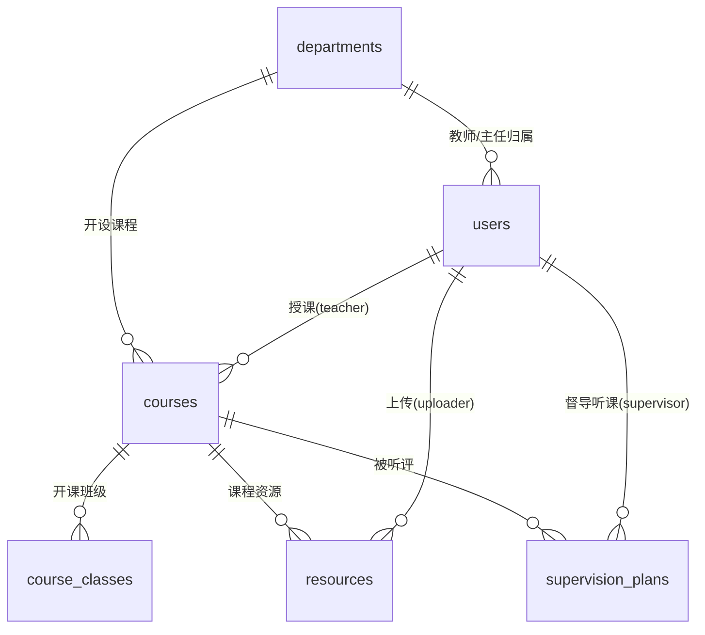

# MySQL 数据库创建指导文档 — aijiaoxue（Sprint 1 · 查课程）

> **文档用途**：指导完成「爱教学」Sprint 1 后端数据库的创建、建表与种子数据初始化，并给出各用户故事的验证 SQL，确保**基础数据链路打通**（数据库 → GORM → API → 前端页面）。
> **配套文档**：后端《AGENTS.md》（Go + Gin 编码规范与接口契约）。两文档中的表结构以本文 DDL 为唯一事实源。
> **执行环境**：MySQL 8.0+（依赖 `utf8mb4_0900_ai_ci` 排序规则，5.7 不适用）、任意 MySQL 客户端（CLI / Navicat / DataGrip 均可）。

---

## 1. 设计总则

| 原则 | 说明 |
|------|------|
| 字符集 | 全库 `utf8mb4`，排序规则 `utf8mb4_0900_ai_ci`，可存中文与特殊字符 |
| 存储引擎 | 全部 InnoDB（事务 + 行锁 + 外键） |
| 命名 | 表/字段 snake_case，表名复数（`courses`），与 GORM 默认约定一致 |
| 汇总不落库 | `studentCount`、`resourceCount`、覆盖率等聚合值**查询时计算**，避免冗余不一致 |
| 枚举 | 角色/状态/类型用 `ENUM`（Sprint 1 取值稳定且少），应用层同步定义常量 |
| 主键 | `BIGINT UNSIGNED AUTO_INCREMENT`，与 Go `uint64` 对应 |
| 时间 | `created_at` / `updated_at` 由数据库维护默认值，GORM 侧只读 |

## 2. 创建数据库与专用账号

```sql
-- 用 root 或管理员账号执行
CREATE DATABASE IF NOT EXISTS `aijiaoxue`
  DEFAULT CHARACTER SET utf8mb4
  COLLATE utf8mb4_0900_ai_ci;

-- 开发专用账号（仅授权本库；生产环境密码另行管理，禁止入库入仓）
CREATE USER IF NOT EXISTS 'aijiaoxue'@'%' IDENTIFIED BY 'aijiaoxue_dev';
GRANT ALL PRIVILEGES ON `aijiaoxue`.* TO 'aijiaoxue'@'%';
FLUSH PRIVILEGES;

USE `aijiaoxue`;
```

> 后端 `config.yaml` 中的 DSN 与此对应：
> `aijiaoxue:aijiaoxue_dev@tcp(127.0.0.1:3306)/aijiaoxue?charset=utf8mb4&parseTime=True&loc=Local`
> **`parseTime=True` 必须携带**，否则 GORM 扫描 DATETIME 报错。

## 3. 数据模型总览（ER 图）



6 张表、3 个角色、3 层数据关系：**组织**（departments ↔ users）→ **教学**（courses + course_classes）→ **质量**（resources / supervision_plans）。Sprint 2/3 的录音转写、评估报告在 `courses` 下扩展新表，不动存量结构。

## 4. 建表 DDL（按依赖顺序执行）

### 4.1 departments — 教研室

```sql
CREATE TABLE `departments` (
  `id`         BIGINT UNSIGNED NOT NULL AUTO_INCREMENT,
  `name`       VARCHAR(64)  NOT NULL COMMENT '教研室名称',
  `code`       VARCHAR(16)  NOT NULL COMMENT '编码，如 SE/CS/AI（课程编码前缀来源）',
  `created_at` DATETIME     NOT NULL DEFAULT CURRENT_TIMESTAMP,
  `updated_at` DATETIME     NOT NULL DEFAULT CURRENT_TIMESTAMP ON UPDATE CURRENT_TIMESTAMP,
  PRIMARY KEY (`id`),
  UNIQUE KEY `uk_dept_name` (`name`)
) ENGINE=InnoDB DEFAULT CHARSET=utf8mb4 COLLATE=utf8mb4_0900_ai_ci COMMENT='教研室';
```

### 4.2 users — 用户（三角色）

```sql
CREATE TABLE `users` (
  `id`            BIGINT UNSIGNED NOT NULL AUTO_INCREMENT,
  `username`      VARCHAR(32) NOT NULL COMMENT '登录名（演示账号：director/teacher/supervisor）',
  `password_hash` VARCHAR(72) NOT NULL COMMENT 'bcrypt 哈希，由 cmd/seed 写入，禁止明文',
  `name`          VARCHAR(32) NOT NULL COMMENT '姓名',
  `role`          ENUM('director','teacher','supervisor') NOT NULL COMMENT '角色',
  `department_id` BIGINT UNSIGNED NULL COMMENT '所属教研室（督导可为 NULL）',
  `job_no`        VARCHAR(16) NOT NULL COMMENT '工号',
  `status`        TINYINT UNSIGNED NOT NULL DEFAULT 1 COMMENT '1 启用 / 0 停用',
  `created_at`    DATETIME NOT NULL DEFAULT CURRENT_TIMESTAMP,
  `updated_at`    DATETIME NOT NULL DEFAULT CURRENT_TIMESTAMP ON UPDATE CURRENT_TIMESTAMP,
  PRIMARY KEY (`id`),
  UNIQUE KEY `uk_username` (`username`),
  KEY `idx_user_dept` (`department_id`),
  CONSTRAINT `fk_user_dept` FOREIGN KEY (`department_id`) REFERENCES `departments` (`id`)
) ENGINE=InnoDB DEFAULT CHARSET=utf8mb4 COLLATE=utf8mb4_0900_ai_ci COMMENT='用户';
```

### 4.3 courses — 课程主表

```sql
CREATE TABLE `courses` (
  `id`            BIGINT UNSIGNED NOT NULL AUTO_INCREMENT,
  `code`          VARCHAR(12)  NOT NULL COMMENT '课程编码，如 SE3101',
  `name`          VARCHAR(128) NOT NULL COMMENT '课程名称',
  `credit`        TINYINT UNSIGNED NOT NULL COMMENT '学分 1-6',
  `hours`         SMALLINT UNSIGNED NOT NULL COMMENT '学时 16-128',
  `semester`      VARCHAR(16)  NOT NULL COMMENT '学期，如 2026-2027-1',
  `department_id` BIGINT UNSIGNED NOT NULL COMMENT '开课教研室',
  `teacher_id`    BIGINT UNSIGNED NOT NULL COMMENT '授课教师',
  `description`   VARCHAR(500) NOT NULL DEFAULT '' COMMENT '课程简介',
  `status`        ENUM('open','draft','closed') NOT NULL DEFAULT 'draft' COMMENT '开课状态',
  `created_at`    DATETIME NOT NULL DEFAULT CURRENT_TIMESTAMP,
  `updated_at`    DATETIME NOT NULL DEFAULT CURRENT_TIMESTAMP ON UPDATE CURRENT_TIMESTAMP,
  PRIMARY KEY (`id`),
  UNIQUE KEY `uk_course_code_semester` (`code`, `semester`),
  KEY `idx_course_dept` (`department_id`),
  KEY `idx_course_teacher` (`teacher_id`),
  KEY `idx_course_semester_status` (`semester`, `status`),
  CONSTRAINT `fk_course_dept` FOREIGN KEY (`department_id`) REFERENCES `departments` (`id`),
  CONSTRAINT `fk_course_teacher` FOREIGN KEY (`teacher_id`) REFERENCES `users` (`id`)
) ENGINE=InnoDB DEFAULT CHARSET=utf8mb4 COLLATE=utf8mb4_0900_ai_ci COMMENT='课程';
```

> `uk_course_code_semester`：同一课程编码可在不同学期重复开出，但**同学期唯一**——S3.1 新增课程冲突（错误码 40901）由该约束兜底。

### 4.4 course_classes — 开课班级

```sql
CREATE TABLE `course_classes` (
  `id`            BIGINT UNSIGNED NOT NULL AUTO_INCREMENT,
  `course_id`     BIGINT UNSIGNED NOT NULL,
  `class_name`    VARCHAR(32)  NOT NULL COMMENT '班级名，如 软工2201',
  `schedule`      VARCHAR(64)  NOT NULL COMMENT '上课时间，如 周一 3-4 节',
  `location`      VARCHAR(64)  NOT NULL COMMENT '上课地点',
  `student_count` SMALLINT UNSIGNED NOT NULL DEFAULT 0 COMMENT '学生数',
  `created_at`    DATETIME NOT NULL DEFAULT CURRENT_TIMESTAMP,
  `updated_at`    DATETIME NOT NULL DEFAULT CURRENT_TIMESTAMP ON UPDATE CURRENT_TIMESTAMP,
  PRIMARY KEY (`id`),
  KEY `idx_class_course` (`course_id`),
  CONSTRAINT `fk_class_course` FOREIGN KEY (`course_id`) REFERENCES `courses` (`id`) ON DELETE CASCADE
) ENGINE=InnoDB DEFAULT CHARSET=utf8mb4 COLLATE=utf8mb4_0900_ai_ci COMMENT='开课班级';
```

> 班级随课程删除级联（CASCADE）——班级是课程的从属信息，无独立磁盘资源。

### 4.5 resources — 课程资源

```sql
CREATE TABLE `resources` (
  `id`          BIGINT UNSIGNED NOT NULL AUTO_INCREMENT,
  `course_id`   BIGINT UNSIGNED NOT NULL,
  `name`        VARCHAR(128) NOT NULL COMMENT '展示文件名',
  `type`        ENUM('pdf','doc','ppt','video','zip','other') NOT NULL COMMENT '按扩展名映射',
  `size`        BIGINT UNSIGNED NOT NULL DEFAULT 0 COMMENT '字节数',
  `file_path`   VARCHAR(255) NOT NULL COMMENT '相对存储路径 uploads/{courseId}/{uuid}{ext}',
  `uploader_id` BIGINT UNSIGNED NOT NULL COMMENT '上传人',
  `uploaded_at` DATETIME NOT NULL DEFAULT CURRENT_TIMESTAMP,
  `created_at`  DATETIME NOT NULL DEFAULT CURRENT_TIMESTAMP,
  `updated_at`  DATETIME NOT NULL DEFAULT CURRENT_TIMESTAMP ON UPDATE CURRENT_TIMESTAMP,
  PRIMARY KEY (`id`),
  KEY `idx_res_course` (`course_id`),
  KEY `idx_res_uploader` (`uploader_id`),
  CONSTRAINT `fk_res_course` FOREIGN KEY (`course_id`) REFERENCES `courses` (`id`),
  CONSTRAINT `fk_res_uploader` FOREIGN KEY (`uploader_id`) REFERENCES `users` (`id`)
) ENGINE=InnoDB DEFAULT CHARSET=utf8mb4 COLLATE=utf8mb4_0900_ai_ci COMMENT='课程资源';
```

> 删除用 **RESTRICT**（默认）：资源在 `uploads/` 有磁盘文件，必须由 service 层"先删文件、再删记录"，禁止数据库静默级联造成孤儿文件。

### 4.6 supervision_plans — 听评课安排

```sql
CREATE TABLE `supervision_plans` (
  `id`             BIGINT UNSIGNED NOT NULL AUTO_INCREMENT,
  `course_id`      BIGINT UNSIGNED NOT NULL COMMENT '被听评课程',
  `supervisor_id`  BIGINT UNSIGNED NOT NULL COMMENT '督导',
  `planned_date`   DATE NOT NULL COMMENT '计划听课日期',
  `status`         ENUM('planned','completed') NOT NULL DEFAULT 'planned',
  `created_at`     DATETIME NOT NULL DEFAULT CURRENT_TIMESTAMP,
  `updated_at`     DATETIME NOT NULL DEFAULT CURRENT_TIMESTAMP ON UPDATE CURRENT_TIMESTAMP,
  PRIMARY KEY (`id`),
  KEY `idx_plan_status` (`status`),
  KEY `idx_plan_course` (`course_id`),
  KEY `idx_plan_supervisor` (`supervisor_id`),
  KEY `idx_plan_date` (`planned_date`),
  CONSTRAINT `fk_plan_course` FOREIGN KEY (`course_id`) REFERENCES `courses` (`id`),
  CONSTRAINT `fk_plan_supervisor` FOREIGN KEY (`supervisor_id`) REFERENCES `users` (`id`)
) ENGINE=InnoDB DEFAULT CHARSET=utf8mb4 COLLATE=utf8mb4_0900_ai_ci COMMENT='听评课安排';
```

## 5. 种子数据（seed.sql）

**演示账号**（与前端登录页"演示角色快捷入口"一致，密码统一 `123456`）：

```sql
USE `aijiaoxue`;

-- 教研室
INSERT INTO `departments` (`id`, `name`, `code`) VALUES
(1, '软件工程教研室', 'SE'),
(2, '计算机系统教研室', 'CS'),
(3, '人工智能教研室', 'AI');

-- 用户（password_hash 为占位，见下方"密码哈希"说明）
INSERT INTO `users` (`id`, `username`, `password_hash`, `name`, `role`, `department_id`, `job_no`) VALUES
(1, 'director',   'REPLACE_WITH_BCRYPT_HASH', '王建国', 'director',   1,    'T2001'),
(2, 'teacher',    'REPLACE_WITH_BCRYPT_HASH', '李明',   'teacher',    1,    'T2011'),
(3, 'zhanghua',   'REPLACE_WITH_BCRYPT_HASH', '张华',   'teacher',    1,    'T2012'),
(4, 'liuyang',    'REPLACE_WITH_BCRYPT_HASH', '刘洋',   'teacher',    2,    'T2021'),
(5, 'supervisor', 'REPLACE_WITH_BCRYPT_HASH', '陈静',   'supervisor', NULL, 'T3001'),
(6, 'zhaolei',    'REPLACE_WITH_BCRYPT_HASH', '赵磊',   'teacher',    3,    'T2031');

-- 课程（当前学期 2026-2027-1；c8 为上学期已结课，用于状态标签演示）
INSERT INTO `courses` (`id`, `code`, `name`, `credit`, `hours`, `semester`, `department_id`, `teacher_id`, `description`, `status`) VALUES
(1, 'SE3101', '软件项目管理',     3, 48, '2026-2027-1', 1, 2, '以用户故事地图与敏捷迭代方法为主线，覆盖立项、规划、执行到收尾全流程。', 'open'),
(2, 'SE2104', '操作系统',         4, 64, '2026-2027-1', 1, 3, '进程管理、内存管理、文件系统与 I/O 子系统的原理与实践。', 'open'),
(3, 'CS3302', '数据库原理',       3, 48, '2026-2027-1', 2, 4, '关系模型、SQL、事务与并发控制、索引与查询优化。', 'open'),
(4, 'SE3205', '软件工程导论',     2, 32, '2026-2027-1', 1, 2, '软件生命周期、需求工程与基础设计方法。', 'open'),
(5, 'AI4101', '机器学习',         3, 48, '2026-2027-1', 3, 6, '监督学习、模型评估与经典算法实践。', 'open'),
(6, 'CS2101', '计算机组成原理',   4, 64, '2026-2027-1', 2, 4, '指令系统、CPU 结构、存储层次与总线。', 'open'),
(7, 'SE4102', '软件测试技术',     2, 32, '2026-2027-1', 1, 3, '测试用例设计、自动化测试与质量度量（建设中）。', 'draft'),
(8, 'AI4202', '深度学习',         3, 48, '2025-2026-2', 3, 6, '神经网络基础与主流框架实践。', 'closed');

-- 开课班级
INSERT INTO `course_classes` (`course_id`, `class_name`, `schedule`, `location`, `student_count`) VALUES
(1, '软工2201',  '周一 3-4 节', '逸夫楼301', 40),
(1, '软工2202',  '周一 3-4 节', '逸夫楼302', 46),
(2, '软件2301',  '周二 1-2 节', '综合楼201', 44),
(2, '软件2302',  '周二 1-2 节', '综合楼202', 42),
(2, '软件2303',  '周二 1-2 节', '综合楼203', 42),
(3, '计科2301',  '周三 3-4 节', '知行楼105', 48),
(3, '计科2302',  '周三 3-4 节', '知行楼106', 47),
(4, '软工2401',  '周四 5-6 节', '逸夫楼201', 45),
(4, '软工2402',  '周四 5-6 节', '逸夫楼202', 44),
(5, '智科2401',  '周五 1-2 节', '智慧楼301', 50),
(5, '智科2402',  '周五 1-2 节', '智慧楼302', 48),
(6, '计科2401',  '周一 5-6 节', '知行楼201', 46),
(6, '计科2402',  '周一 5-6 节', '知行楼202', 45),
(8, '智科2301',  '周三 1-2 节', '智慧楼201', 50);

-- 课程资源（file_path 为示例相对路径，实际由上传接口生成）
INSERT INTO `resources` (`course_id`, `name`, `type`, `size`, `file_path`, `uploader_id`, `uploaded_at`) VALUES
(1, '第01讲-项目立项与章程.pdf', 'pdf',  2516582,  'uploads/1/3f2a-demo-01.pdf', 2, '2026-09-02 09:30:00'),
(1, '课程大纲-2026版.doc',       'doc',  483328,   'uploads/1/3f2a-demo-02.doc', 2, '2026-09-01 14:00:00'),
(1, '实验1-需求调研模板.zip',    'zip',  1048576,  'uploads/1/3f2a-demo-03.zip', 2, '2026-09-08 10:15:00'),
(2, '第01讲-操作系统概述.ppt',   'ppt',  15728640, 'uploads/2/5b1c-demo-01.ppt', 3, '2026-09-03 08:45:00'),
(3, '第01讲-数据库绪论.pdf',     'pdf',  3145728,  'uploads/3/7d4e-demo-01.pdf', 4, '2026-09-04 16:20:00'),
(5, '第01讲-机器学习概述.pdf',   'pdf',  4194304,  'uploads/5/9c6f-demo-01.pdf', 6, '2026-09-05 11:00:00');

-- 听评课安排（督导：陈静；覆盖 c1/c3/c5 三门已完成的听评）
INSERT INTO `supervision_plans` (`course_id`, `supervisor_id`, `planned_date`, `status`) VALUES
(1, 5, '2026-09-12', 'completed'),
(2, 5, '2026-09-18', 'planned'),
(3, 5, '2026-09-08', 'completed'),
(5, 5, '2026-09-10', 'completed'),
(6, 5, '2026-09-22', 'planned');
```

### 5.1 密码哈希处理（重要）

`password_hash` 必须是 `123456` 的 **bcrypt** 哈希（cost 10），不能用明文或 SHA。两种处理方式任选其一：

**方式 A（推荐）——后端种子工具**：进入后端仓库执行 `make seed`（`go run ./cmd/seed`），该工具会用 bcrypt 生成正确哈希并 UPDATE 全部演示账号。

**方式 B——手动生成后替换**：在任意可运行 Go 的目录执行：

```go
package main

import (
    "fmt"
    "golang.org/x/crypto/bcrypt"
)

func main() {
    h, _ := bcrypt.GenerateFromPassword([]byte("123456"), 10)
    fmt.Println(string(h)) // 复制输出
}
```

然后执行：

```sql
UPDATE `users` SET `password_hash` = '<粘贴上面输出的哈希>'
WHERE `username` IN ('director','teacher','supervisor','zhanghua','liuyang','zhaolei');
```

### 5.2 种子数据核对（执行后自查）

```sql
-- 应返回：departments=3, users=6, courses=8, course_classes=14, resources=6, supervision_plans=5
SELECT
  (SELECT COUNT(*) FROM departments)      AS departments,
  (SELECT COUNT(*) FROM users)            AS users,
  (SELECT COUNT(*) FROM courses)          AS courses,
  (SELECT COUNT(*) FROM course_classes)   AS classes,
  (SELECT COUNT(*) FROM resources)        AS resources,
  (SELECT COUNT(*) FROM supervision_plans) AS plans;
```

## 6. 用户故事 → 核心 SQL 映射

以下 SQL 即各接口的数据层实现依据（service 拼接数据范围条件 + 筛选条件后交由 GORM 执行等价查询）。

### S2.1 主任：本教研室课程（dept_id = 1）

```sql
SELECT c.id, c.code, c.name, u.name AS teacher_name, d.name AS department,
       c.semester, c.status,
       (SELECT COUNT(*) FROM course_classes cc WHERE cc.course_id = c.id) AS class_count,
       (SELECT COALESCE(SUM(cc.student_count), 0) FROM course_classes cc WHERE cc.course_id = c.id) AS student_count,
       (SELECT COUNT(*) FROM resources r WHERE r.course_id = c.id) AS resource_count
FROM courses c
JOIN users u       ON u.id = c.teacher_id
JOIN departments d ON d.id = c.department_id
WHERE c.department_id = 1          -- 主任数据范围（来自 JWT 解出的 deptID）
ORDER BY c.code;
-- 期望：4 行（c1/c2/c4/c7，含 draft）
```

### S2.2 教师：本人课程（teacher_id = 2 李明）

```sql
-- 同上查询，WHERE 改为：
WHERE c.teacher_id = 2             -- 教师数据范围（来自 JWT 的 userID）
-- 期望：2 行（c1 软件项目管理、c4 软件工程导论）
```

### S2.3 督导：全校课程

```sql
-- 同上查询，无数据范围条件，可选追加筛选（semester / department_id / status / keyword）
-- 期望：8 行（含上学期已结课的 c8）
```

> 关键词搜索（keyword）对应：`c.name LIKE CONCAT('%', ?, '%') OR c.code LIKE CONCAT('%', ?, '%')`，参数化传值防注入。

### S4.1 课程详情聚合（以 c1 为例）

```sql
-- 学生人次汇总：期望 86（40 + 46）
SELECT COALESCE(SUM(student_count), 0) AS student_count
FROM course_classes WHERE course_id = 1;

-- 资源列表
SELECT r.id, r.name, r.type, r.size, u.name AS uploader, r.uploaded_at
FROM resources r JOIN users u ON u.id = r.uploader_id
WHERE r.course_id = 1
ORDER BY r.uploaded_at DESC;       -- 期望 3 行
```

### S5.1 督导覆盖率（口径：当前学期 open 课程为分母）

```sql
-- 总体：期望 total=6, supervised=3, rate=0.5000
SELECT
  COUNT(*) AS total_courses,
  (SELECT COUNT(DISTINCT sp.course_id)
     FROM supervision_plans sp
     JOIN courses c ON c.id = sp.course_id
    WHERE sp.status = 'completed'
      AND c.semester = '2026-2027-1'
      AND c.status = 'open') AS supervised_courses
FROM courses
WHERE semester = '2026-2027-1' AND status = 'open';

-- 分教研室：期望 SE 1/3≈0.3333、CS 1/2=0.5、AI 1/1=1.0
SELECT d.name AS department,
       COUNT(DISTINCT c.id) AS total,
       COUNT(DISTINCT CASE WHEN sp.status = 'completed' THEN c.id END) AS supervised,
       ROUND(COUNT(DISTINCT CASE WHEN sp.status = 'completed' THEN c.id END) / COUNT(DISTINCT c.id), 4) AS rate
FROM courses c
JOIN departments d ON d.id = c.department_id
LEFT JOIN supervision_plans sp ON sp.course_id = c.id
WHERE c.semester = '2026-2027-1' AND c.status = 'open'
GROUP BY d.id, d.name;

-- 听评课安排（含课程与人员信息）：期望 5 行
SELECT sp.id, c.name AS course_name, tu.name AS teacher_name, su.name AS supervisor_name,
       sp.planned_date, sp.status
FROM supervision_plans sp
JOIN courses c  ON c.id = sp.course_id
JOIN users tu   ON tu.id = c.teacher_id
JOIN users su   ON su.id = sp.supervisor_id
ORDER BY sp.planned_date;
```

### 期望值速查表（联调对账用）

| 指标 | 期望值 |
|------|--------|
| 主任工作台：本室课程数 / 教师数 / 班次数 / 资源数 | 4 / 3 / 7 / 4 |
| 教师工作台（李明）：课程数 / 班次 / 学生人次 / 资源数 | 2 / 4 / 175 / 3 |
| 督导工作台：open 课程数 / 计划数 / 已完成 / 覆盖率 | 6 / 5 / 3 / 50% |
| 课程 c1：班级数 / 学生人次 / 资源数 | 2 / 86 / 3 |
| 覆盖率分教研室 | SE 33.33% · CS 50% · AI 100% |

> 注：主任班次数 7 = c1(2) + c2(3) + c4(2)（draft 课程 c7 无班级）；主任资源数 4 = 本室课程 c1(3) + c2(1)。

## 7. 数据链路联调验收（端到端打通）

按顺序执行，任何一步失败即定位断点：

```
MySQL（本文档） → GORM 连接 → 后端 API（后端 AGENTS.md §15 verify.sh） → 前端页面（关 Mock）
```

1. **库**：执行 §2 建库建账号 → §4 六张 DDL → §5 种子数据 → §5.2 核对通过；
2. **连接**：后端 `make run`，启动日志无 `db.Ping()` 报错（DSN 错误 / parseTime 缺失在这一步暴露）；
3. **接口**：运行后端 AGENTS.md §15 的 `verify.sh`，重点比对三角色 `GET /courses` 返回的 `total`（主任 4、教师 2、督导 8）与 §6 期望值；
4. **页面**：前端 `.env.development` 设 `VITE_USE_MOCK=false`（并配置 Vite proxy 指向 `127.0.0.1:8080`），依次验证：三角色登录 → 工作台统计卡数值 = §6 速查表 → 课程列表/详情 → 主任新增课程后列表 +1 → 教师上传资源后详情 Tab 可见 → 督导覆盖率 50%；
5. **回写核对**：页面上传的文件落 `uploads/{courseId}/`，`resources` 表新增一行；新增课程可在 MySQL 中 `SELECT * FROM courses ORDER BY id DESC` 看到。

## 8. GORM 对接要点（后端实现参考）

```go
// internal/model/course.go（示例，字段与本文 DDL 一一对应）
type Course struct {
    ID           uint64    `gorm:"primaryKey"`
    Code         string    `gorm:"column:code;size:12;uniqueIndex:uk_course_code_semester,priority:1"`
    Name         string    `gorm:"column:name;size:128"`
    Credit       int       `gorm:"column:credit"`
    Hours        int       `gorm:"column:hours"`
    Semester     string    `gorm:"column:semester;size:16;uniqueIndex:uk_course_code_semester,priority:2;index:idx_course_semester_status,priority:1"`
    DepartmentID uint64    `gorm:"column:department_id;index"`
    TeacherID    uint64    `gorm:"column:teacher_id;index"`
    Description  string    `gorm:"column:description;size:500"`
    Status       string    `gorm:"column:status"`
    CreatedAt    time.Time `gorm:"column:created_at"`
    UpdatedAt    time.Time `gorm:"column:updated_at"`
}
func (Course) TableName() string { return "courses" }
```

- **不使用 AutoMigrate**：表结构以本文 schema.sql 为唯一事实源，避免代码与数据库双源漂移；
- 关联查询用 `Joins("JOIN users u ON u.id = courses.teacher_id")` 显式写法（列表性能可控），预加载 `Preload` 仅用于详情页班级；
- 聚合子查询（studentCount / resourceCount）用 `Select` 原生子查询表达式，禁止循环 N+1 查询；
- 事务：Sprint 1 仅"删除资源（删记录 + 删文件）"需要 service 层编排，数据库侧单条 DELETE 自带原子性。

## 9. 迁移与演进策略

| 阶段 | 动作 |
|------|------|
| Sprint 1 | schema.sql + seed.sql 手工执行（本文档）；表结构变更 = 更新 schema.sql + 后端 model + PR 说明列明 |
| Sprint 2（看课堂） | 新增 `recordings`（课堂录音）、`transcripts`（转写文本，挂 ASR 智能体）、`evaluation_records`（听评记录）；均以 `course_id` 外键挂接，**不改存量表** |
| Sprint 3（帮教师） | 新增 `quality_reports`（质量报告）、`knowledge_base`（教学知识库条目） |
| 版本化时机 | 从 Sprint 2 起引入 `golang-migrate`（`migrations/V2__add_recordings.sql`），Sprint 1 不引入以保持简单 |

## 10. 备份与恢复

```bash
# 备份（结构 + 数据）
mysqldump -u aijiaoxue -p --default-character-set=utf8mb4 aijiaoxue > aijiaoxue_$(date +%F).sql

# 恢复
mysql -u root -p --default-character-set=utf8mb4 aijiaoxue < aijiaoxue_2026-09-13.sql
```

开发期建议每轮迭代评审前备份一次；`uploads/` 目录单独用文件备份。

## 11. 常见问题排查

| 现象 | 原因与处理 |
|------|-----------|
| GORM 扫描时间字段报 `sql: Scan error` | DSN 缺 `parseTime=True` |
| 中文乱码 | 连接串缺 `charset=utf8mb4`，或客户端连接字符集不对 |
| `Unknown collation: 'utf8mb4_0900_ai_ci'` | MySQL 版本低于 8.0；升级，或全量替换为 `utf8mb4_general_ci` |
| 登录返回 40101（密码正确） | 种子数据 password_hash 仍是占位串——执行 §5.1 覆写 |
| 新增课程报 40901 | 同学期同编码已存在（`uk_course_code_semester`），属预期行为 |
| 删除课程失败（外键约束） | resources 为 RESTRICT：Sprint 1 无删课程功能，属预期；若手工清理，先删子表 |
| Windows 下时间差 8 小时 | DSN 缺 `loc=Local` |

---

*文档版本：v1.0（Sprint 1 设计阶段产出）· 维护人：成员四（胡凯翔，后端架构）· 数据口径评审：成员一（徐仕杰，DRI）· 联调对接：成员二（刘子杰，前端）*
