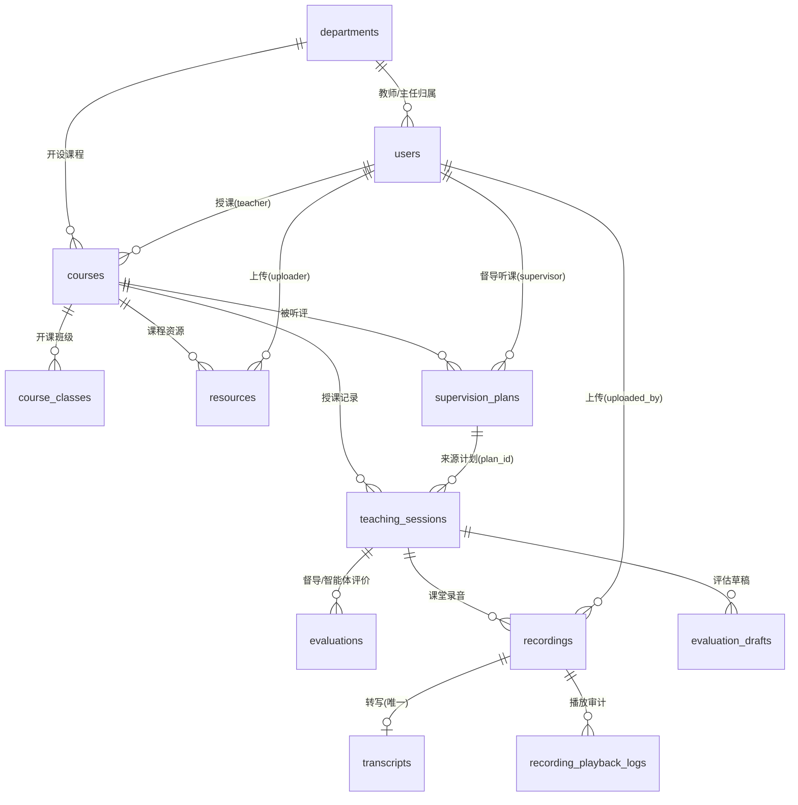

# MySQL 数据库创建指导文档 — aijiaoxue（Sprint 1 基线 + Sprint 2 增量，迁移至 V6）

> **文档用途**：指导完成「爱教学」后端数据库的创建、建表与种子数据初始化，并给出各用户故事的验证 SQL，确保**基础数据链路打通**（数据库 → GORM → API → 前端页面）。
> **DDL 事实源**：**本文件不复制表 DDL**——基线表见 `backend/database/schema.sql`，增量表见 `backend/migrations/`（表清单见 §4，迁移清单见 §9）。
> **配套文档**：后端 [`backend_AGENTS.md`](./backend_AGENTS.md)（Go + Gin 编码规范与接口契约）；Sprint 2/3 的评分体系、评分聚合 SQL 与接口契约以 [`Sprint2-3-教学评价与提优-开发计划.md`](./Sprint2-3-教学评价与提优-开发计划.md) §2/§3 为准。
> **执行环境**：MySQL 8.0+（依赖 `utf8mb4_0900_ai_ci` 排序规则，5.7 不适用）、任意 MySQL 客户端（CLI / Navicat / DataGrip 均可）。

---

## 1. 设计总则

| 原则 | 说明 |
|------|------|
| 字符集 | 全库 `utf8mb4`，排序规则 `utf8mb4_0900_ai_ci`，可存中文与特殊字符（`database/schema.sql:6-8`，12 张表逐表声明一致） |
| 存储引擎 | 全部 InnoDB（事务 + 行锁 + 外键） |
| 命名 | 表/字段 snake_case，表名复数（`courses`），与 GORM 默认约定一致 |
| 汇总不落库 | `studentCount`、`resourceCount`、覆盖率等聚合值**查询时计算**（子查询/联表），避免冗余不一致 |
| 枚举 | 受控状态与类别用 `ENUM`（角色、课程状态、资源类型、授课记录状态、评价来源、转写状态），应用层同步定义常量 |
| 主键 | `BIGINT UNSIGNED AUTO_INCREMENT`，与 Go `uint64` 对应 |
| 时间 | `created_at` / `updated_at` 由数据库维护默认值，应用层不手工赋值；审计类表只有事件时间列（`recordings.uploaded_at`、`recording_playback_logs.started_at`） |

## 2. 创建数据库与专用账号

```sql
-- 用 root 或管理员账号执行
CREATE DATABASE IF NOT EXISTS `aijiaoxue`
  DEFAULT CHARACTER SET utf8mb4
  COLLATE utf8mb4_0900_ai_ci;

-- 开发专用账号（仅授权本库；生产环境密码另行管理，禁止入库入仓）
CREATE USER IF NOT EXISTS 'aijiaoxue'@'%' IDENTIFIED BY 'aijiaoxue_dev';
GRANT ALL PRIVILEGES ON `aijiaoxue`.* TO 'aijiaoxue'@'%';
FLUSH PRIVILEGES;

USE `aijiaoxue`;
```

> 后端 `config.yaml` 中的 DSN 形态如下（正式 MySQL 用 `3306`，容器内实例见下条）：
> `aijiaoxue:aijiaoxue_dev@tcp(127.0.0.1:3306)/aijiaoxue?charset=utf8mb4&parseTime=True&loc=Local`
> **`parseTime=True` 必须携带**，否则 GORM 扫描 DATETIME 报错。
> 🔌 **端口**：本仓库开发容器另有一个免 root 实例监听 `127.0.0.1:3307`，`backend/config.yaml` 的 DSN 已指向 3307（见 `README.md`「容器内本地 MySQL」）——改端口时 DSN 与 `MYSQL_PORT` 必须同步。
>
> 🪟 **Windows 首次搭建**（MySQL Installer 安装 + 服务启动 + Git Bash 初始化 + 无 make 等价命令）见 [`README.md`](../README.md) 附录 C。
> 本文 `§2` 的 SQL 假定机器上已有一个可用的 MySQL 8.0 服务——附录 C 覆盖了"从零装 MySQL 并启动"这一步。

## 3. 数据模型总览（ER 图）


```mermaid
erDiagram
    departments ||--o{ users : "教师/主任归属"
    departments ||--o{ courses : "开设课程"
    users ||--o{ courses : "授课(teacher)"
    courses ||--o{ course_classes : "开课班级"
    courses ||--o{ resources : "课程资源"
    users ||--o{ resources : "上传(uploader)"
    courses ||--o{ supervision_plans : "被听评"
    users ||--o{ supervision_plans : "督导听课(supervisor)"
    courses ||--o{ teaching_sessions : "授课记录"
    supervision_plans ||--o{ teaching_sessions : "来源计划(plan_id)"
    teaching_sessions ||--o{ evaluations : "督导/智能体评价"
    teaching_sessions ||--o{ recordings : "课堂录音"
    users ||--o{ recordings : "上传(uploaded_by)"
    recordings ||--o| transcripts : "转写(唯一)"
    recordings ||--o{ recording_playback_logs : "播放审计"
    teaching_sessions ||--o{ evaluation_drafts : "评估草稿"
```

共 **12 张表、3 个角色**，5 层数据关系：**组织**（departments ↔ users）→ **教学**（courses + course_classes）→ **质量**（resources / supervision_plans）→ **课堂评价**（teaching_sessions → evaluations / evaluation_drafts）→ **音频链路**（recordings → transcripts / recording_playback_logs）。Sprint 1 的 6 张存量表结构未变，Sprint 2 起只新增表。表清单见 §4，迁移清单见 §9。

> 图中只画外键约束存在的关系（`teaching_sessions.class_id`、`evaluations.evaluator_id`、`evaluation_drafts.supervisor_id` 无外键，不参与画线）。

## 4. 表清单与 DDL 事实源

> **本文件不复制表 DDL**，避免与代码双源漂移。事实源是代码：
> - **基线表（6 张）**：`backend/database/schema.sql`，全部 `CREATE TABLE IF NOT EXISTS`，幂等可重复执行；
> - **增量表（6 张）**：`backend/migrations/*.up.sql`，由 golang-migrate 执行，脚本经 `backend/migrations/migrations.go` 以 `embed` 打包；
> - **改表流程**：新增一个迁移版本（`.up.sql` + `.down.sql`）并同步 `backend/internal/model/`，**禁止 GORM `AutoMigrate`**。

| # | 表 | 用途 | 建表位置 |
|---|----|------|----------|
| 1 | `departments` | 教研室 | `backend/database/schema.sql` |
| 2 | `users` | 用户（`director` / `teacher` / `supervisor`） | `backend/database/schema.sql` |
| 3 | `courses` | 课程主表 | `backend/database/schema.sql` |
| 4 | `course_classes` | 开课班级 | `backend/database/schema.sql` |
| 5 | `resources` | 课程资源 | `backend/database/schema.sql` |
| 6 | `supervision_plans` | 听评课安排 | `backend/database/schema.sql` |
| 7 | `teaching_sessions` | 授课记录（一切评价的落点） | `backend/migrations/2_teaching_sessions_and_evaluations.up.sql` |
| 8 | `evaluations` | 督导 + 智能体评价同表（`evaluator_type` 区分） | `backend/migrations/2_teaching_sessions_and_evaluations.up.sql` |
| 9 | `recordings` | 课堂录音 | `backend/migrations/3_recordings_and_transcripts.up.sql` |
| 10 | `transcripts` | 课堂转写（异步任务产物） | `backend/migrations/3_recordings_and_transcripts.up.sql` |
| 11 | `recording_playback_logs` | 录音播放审计日志 | `backend/migrations/3_recordings_and_transcripts.up.sql` |
| 12 | `evaluation_drafts` | 督导评估草稿（未生效的私人副本） | `backend/migrations/5_evaluation_drafts.up.sql` |

**关键约束（选摘，字段级定义以脚本为准）**：

| 约束 | 所在表 | 作用 |
|------|--------|------|
| `uk_course_code_semester(code, semester)` | `courses` | 同学期同编码唯一——S3.1 新增课程冲突（错误码 40901）由它兜底 |
| `fk_class_course ... ON DELETE CASCADE` | `course_classes` | 班级是课程从属信息，随课程删除级联 |
| `fk_res_course`（默认 RESTRICT） | `resources` | 资源在 `uploads/` 有磁盘文件，必须 service 层"先删文件、再删记录"，禁止静默级联造成孤儿文件 |
| `uk_session(course_id, class_id, session_date, period)` | `teaching_sessions` | `class_id NOT NULL DEFAULT 0`（0=未指定）——MySQL 唯一索引对 NULL 不去重，故不能用 NULL 表示"未指定班级" |
| `uk_eval(session_id, evaluator_type, evaluator_id)` | `evaluations` | 同一场次、同一评价源只能有一条评价 |
| `uk_draft(session_id, supervisor_id)` | `evaluation_drafts` | 同一督导对同一场次至多一份草稿；提交后写入 `evaluations` 并删除草稿 |

## 5. 种子数据（database/seed.sql）

**演示账号**（与前端登录页"演示角色快捷入口"一致，密码统一 `123456`）：`director`、`teacher`、`zhanghua`、`liuyang`、`supervisor`、`zhaolei`。完整 INSERT 语句以 `backend/database/seed.sql` 为准，本文件不复制。

**加载顺序**（与 `backend/scripts/init_db.sh` 一致）：

```bash
cd backend
bash scripts/init_db.sh   # 一键：[1/4] schema.sql → [2/4] migrate up → [3/4] seed.sql → [4/4] cmd/seed，末尾自动自查

# 或分步执行：
mysql -u root -p < database/schema.sql
go run ./cmd/migrate -config config.yaml up
mysql -u root -p aijiaoxue < database/seed.sql
make seed                 # = go run ./cmd/seed -config config.yaml，用 bcrypt 覆写演示账号哈希
```

> 幂等性：`seed.sql` 先 `SET FOREIGN_KEY_CHECKS = 0`，再按外键顺序 `TRUNCATE` **9 张表**（含 `evaluation_drafts`），可反复执行。

**各表种子行数**（执行 `seed.sql` 后、尚无运行期数据时）：

| 表 | 行数 | 内容要点 |
|----|------|----------|
| `departments` | 3 | SE / CS / AI 三个教研室 |
| `users` | 6 | 1 主任 + 4 教师 + 1 督导 |
| `courses` | 8 | 当前学期 `2026-2027-1` 共 7 门（6 `open` + 1 `draft`），另有 1 门上学期 `closed` |
| `course_classes` | 14 | c1×2、c2×3、c3×2、c4×2、c5×2、c6×2、c8×1 |
| `resources` | 6 | c1×3、c2 / c3 / c5 各 1 |
| `supervision_plans` | 7 | 3 `completed` + 4 `planned`（含 `CURDATE()` 当日计划，供"今日待评"演示） |
| `teaching_sessions` | 14 | 覆盖 4 位教师（李明/张华/刘洋/赵磊）、6 门课程，全部 `evaluated` |
| `evaluations` | 28 | 14 条督导（`evaluator_type='supervisor'`）+ 14 条智能体（`'agent'`），两侧五维齐全 |
| `evaluation_drafts` | 0 | 草稿是督导运行期产生的私人副本，不预置 |

### 5.1 密码哈希处理（重要）

`password_hash` 必须是 `123456` 的 **bcrypt** 哈希（cost 10），不能用明文或 SHA。两种处理方式任选其一：

**方式 A（推荐）——后端种子工具**：进入后端仓库执行 `make seed`（`go run ./cmd/seed`），该工具会用 bcrypt 生成正确哈希并 UPDATE 全部演示账号。

**方式 B——手动生成后替换**：在任意可运行 Go 的目录执行：

```go
package main

import (
    "fmt"
    "golang.org/x/crypto/bcrypt"
)

func main() {
    h, _ := bcrypt.GenerateFromPassword([]byte("123456"), 10)
    fmt.Println(string(h)) // 复制输出
}
```

然后执行：

```sql
UPDATE `users` SET `password_hash` = '<粘贴上面输出的哈希>'
WHERE `username` IN ('director','teacher','supervisor','zhanghua','liuyang','zhaolei');
```

### 5.2 种子数据核对（执行后自查）

```sql
-- 应返回：departments=3 users=6 courses=8 classes=14 resources=6 plans=7 sessions=14 evaluations=28
-- （与 backend/scripts/init_db.sh 第 4 步自查口径一致）
SELECT
  (SELECT COUNT(*) FROM departments)       AS departments,
  (SELECT COUNT(*) FROM users)             AS users,
  (SELECT COUNT(*) FROM courses)           AS courses,
  (SELECT COUNT(*) FROM course_classes)    AS classes,
  (SELECT COUNT(*) FROM resources)         AS resources,
  (SELECT COUNT(*) FROM supervision_plans) AS plans,
  (SELECT COUNT(*) FROM teaching_sessions) AS sessions,
  (SELECT COUNT(*) FROM evaluations)       AS evaluations;
```

## 6. 用户故事 → 核心 SQL 映射

以下 SQL 即各接口的数据层实现依据（service 拼接数据范围条件 + 筛选条件后交由 GORM 执行等价查询）。

### S2.1 主任：本教研室课程（dept_id = 1）

```sql
SELECT c.id, c.code, c.name, u.name AS teacher_name, d.name AS department,
       c.semester, c.status,
       (SELECT COUNT(*) FROM course_classes cc WHERE cc.course_id = c.id) AS class_count,
       (SELECT COALESCE(SUM(cc.student_count), 0) FROM course_classes cc WHERE cc.course_id = c.id) AS student_count,
       (SELECT COUNT(*) FROM resources r WHERE r.course_id = c.id) AS resource_count
FROM courses c
JOIN users u       ON u.id = c.teacher_id
JOIN departments d ON d.id = c.department_id
WHERE c.department_id = 1          -- 主任数据范围（来自 JWT 解出的 deptID）
ORDER BY c.code;
-- 期望：4 行（c1/c2/c4/c7，含 draft）
```

### S2.2 教师：本人课程（teacher_id = 2 李明）

```sql
-- 同上查询，WHERE 改为：
WHERE c.teacher_id = 2             -- 教师数据范围（来自 JWT 的 userID）
-- 期望：2 行（c1 软件项目管理、c4 软件工程导论）
```

### S2.3 督导：全校课程

```sql
-- 同上查询，无数据范围条件，可选追加筛选（semester / department_id / status / keyword）
-- 期望：8 行（含上学期已结课的 c8）
```

> 关键词搜索（keyword）对应：`c.name LIKE CONCAT('%', ?, '%') OR c.code LIKE CONCAT('%', ?, '%')`，参数化传值防注入。

### S4.1 课程详情聚合（以 c1 为例）

```sql
-- 学生人次汇总：期望 86（40 + 46）
SELECT COALESCE(SUM(student_count), 0) AS student_count
FROM course_classes WHERE course_id = 1;

-- 资源列表
SELECT r.id, r.name, r.type, r.size, u.name AS uploader, r.uploaded_at
FROM resources r JOIN users u ON u.id = r.uploader_id
WHERE r.course_id = 1
ORDER BY r.uploaded_at DESC;       -- 期望 3 行
```

### S5.1 督导覆盖率（口径：当前学期 open 课程为分母）

```sql
-- 总体：期望 total=6, supervised=3, rate=0.5000
SELECT
  COUNT(*) AS total_courses,
  (SELECT COUNT(DISTINCT sp.course_id)
     FROM supervision_plans sp
     JOIN courses c ON c.id = sp.course_id
    WHERE sp.status = 'completed'
      AND c.semester = '2026-2027-1'
      AND c.status = 'open') AS supervised_courses
FROM courses
WHERE semester = '2026-2027-1' AND status = 'open';

-- 分教研室：期望 SE 1/3≈0.3333、CS 1/2=0.5、AI 1/1=1.0
SELECT d.name AS department,
       COUNT(DISTINCT c.id) AS total,
       COUNT(DISTINCT CASE WHEN sp.status = 'completed' THEN c.id END) AS supervised,
       ROUND(COUNT(DISTINCT CASE WHEN sp.status = 'completed' THEN c.id END) / COUNT(DISTINCT c.id), 4) AS rate
FROM courses c
JOIN departments d ON d.id = c.department_id
LEFT JOIN supervision_plans sp ON sp.course_id = c.id
WHERE c.semester = '2026-2027-1' AND c.status = 'open'
GROUP BY d.id, d.name;

-- 听评课安排（含课程与人员信息；等价于 supervisionRepository.ListPlans）：期望 7 行
SELECT sp.id, c.name AS course_name, tu.name AS teacher_name, su.name AS supervisor_name,
       sp.planned_date, sp.status
FROM supervision_plans sp
JOIN courses c  ON c.id = sp.course_id
JOIN users tu   ON tu.id = c.teacher_id
JOIN users su   ON su.id = sp.supervisor_id
ORDER BY sp.planned_date;
```

### 期望值速查表（联调对账用）

| 指标 | 期望值 |
|------|--------|
| 主任工作台：本室课程数 / 教师数 / 班次数 / 资源数 | 4 / 3 / 7 / 4 |
| 教师工作台（李明）：课程数 / 班次 / 学生人次 / 资源数 | 2 / 4 / 175 / 3 |
| 督导工作台：`recentPlans` / `pendingSessions` | 7 / 0（种子 14 场次全部 `evaluated`） |
| 覆盖率接口 `GET /api/v1/supervision/coverage`：分母 / 分子 / 覆盖率 | 6 / 3 / 50% |
| 课程 c1：班级数 / 学生人次 / 资源数 | 2 / 86 / 3 |
| 覆盖率分教研室 | SE 33.33% · CS 50% · AI 100% |

> 注：主任班次数 7 = c1(2) + c2(3) + c4(2)（draft 课程 c7 无班级）；主任资源数 4 = 本室课程 c1(3) + c2(1)；主任教师数 3 = 本教研室全部用户数（`userRepository.CountByDepartment`，含主任本人）。督导工作台只返回待评课队列与草稿箱，课程数/覆盖率已移到独立覆盖率接口（`internal/dto/dashboard.go` 的 `SupervisorDashboard`）。

## 7. 数据链路联调验收（端到端打通）

按顺序执行，任何一步失败即定位断点：

```
MySQL（本文档） → GORM 连接 → 后端 API（后端 AGENTS.md §15 verify.sh） → 前端页面
```

1. **库**：执行 §2 建库建账号 → §4 建表（`database/schema.sql` + `migrations/`）→ §5 种子数据 → §5.2 核对通过；或直接 `cd backend && bash scripts/init_db.sh` 一键完成（末尾自带同名自查）；
2. **连接**：后端 `make run`，启动日志无 `db.Ping()` 报错（DSN 错误 / parseTime 缺失 / 端口不一致在这一步暴露）；
3. **接口**：运行后端 AGENTS.md §15 的 `verify.sh`，重点比对三角色 `GET /courses` 返回的 `total`（主任 4、教师 2、督导 8）与 §6 期望值；
4. **页面**：前端 `.env.development` 已配置 `VITE_API_BASE_URL=/api/v1` 与 `VITE_PROXY_TARGET=http://127.0.0.1:8080`（`frontend/vite.config.ts` 经 Vite proxy 转发到后端），依次验证：三角色登录 → 工作台统计卡数值 = §6 速查表 → 课程列表/详情 → 主任新增课程后列表 +1 → 教师上传资源后详情 Tab 可见 → 覆盖率接口返回 50%；
5. **回写核对**：页面上传的文件落 `uploads/{courseId}/`，`resources` 表新增一行；新增课程可在 MySQL 中 `SELECT * FROM courses ORDER BY id DESC` 看到。

## 8. GORM 对接要点（后端实现参考）

```go
// 示意（实际实现见 backend/internal/model/course.go；列定义以 database/schema.sql 为准）
type Course struct {
    ID           uint64    `gorm:"primaryKey"`
    Code         string    `gorm:"column:code;size:12;uniqueIndex:uk_course_code_semester,priority:1"`
    Name         string    `gorm:"column:name;size:128"`
    Credit       int       `gorm:"column:credit"`
    Hours        int       `gorm:"column:hours"`
    Semester     string    `gorm:"column:semester;size:16;uniqueIndex:uk_course_code_semester,priority:2;index:idx_course_semester_status,priority:1"`
    DepartmentID uint64    `gorm:"column:department_id;index"`
    TeacherID    uint64    `gorm:"column:teacher_id;index"`
    Description  string    `gorm:"column:description;size:500"`
    Status       string    `gorm:"column:status"`
    CreatedAt    time.Time `gorm:"column:created_at"`
    UpdatedAt    time.Time `gorm:"column:updated_at"`
}
func (Course) TableName() string { return "courses" }
```

- **不使用 AutoMigrate**：表结构以 `database/schema.sql`（Sprint 1 基线）+ `migrations/*.up.sql`（Sprint 2 起增量）为唯一事实源，`internal/model/` 只做映射，避免代码与数据库双源漂移；
- 关联查询用 `Joins("JOIN users u ON u.id = courses.teacher_id")` 显式写法（列表性能可控），预加载 `Preload` 仅用于详情页班级；
- 聚合子查询（studentCount / resourceCount）用 `Select` 原生子查询表达式，禁止循环 N+1 查询；
- 事务：Sprint 1 仅"删除资源（删记录 + 删文件）"需要 service 层编排，数据库侧单条 DELETE 自带原子性。

## 9. 迁移与演进策略

> **事实源分工**：`database/schema.sql` 只负责 **Sprint 1 存量表**（`departments` / `users` / `courses` / `course_classes` / `resources` / `supervision_plans`）；
> **Sprint 2 起的新表以 `migrations/` 下的迁移脚本为唯一事实源**，`schema.sql` 不再重复维护它们。
> 初始化流程见 `backend/scripts/init_db.sh`：`schema.sql → migrate up → seed.sql → cmd/seed`。

**迁移清单（`backend/migrations/`，共 6 个版本，最新 V6）**：

| 版本 | 文件（`.up.sql` / `.down.sql`） | 变更 |
|------|------|------|
| 1 | `1_baseline_sprint1` | 基线 6 表（`CREATE TABLE IF NOT EXISTS`，内容与 `schema.sql` 一致；对已按 schema.sql 建过表的库只补记版本号）。建库与开发账号不在迁移范围内 |
| 2 | `2_teaching_sessions_and_evaluations` | 新建 `teaching_sessions`、`evaluations`（`uk_session`、`uk_eval`；外键指向 `courses` / `supervision_plans` / `teaching_sessions`） |
| 3 | `3_recordings_and_transcripts` | 新建 `recordings`、`transcripts`、`recording_playback_logs`（`uk_rec_session`、`uk_tr_session`） |
| 4 | `4_transcripts_content_default` | `ALTER transcripts.content` 补 `DEFAULT ('')`，避免绕过 GORM 的写入在 `STRICT_TRANS_TABLES` 下触发 1364 |
| 5 | `5_evaluation_drafts` | 新建 `evaluation_drafts`（`uk_draft(session_id, supervisor_id)`） |
| 6 | `6_transcripts_engine_width` | `ALTER transcripts.engine` / `engine_version` 放宽到 `VARCHAR(64)`——原 `VARCHAR(32)` 装不下百炼真实模型名 `qwen-audio-3.1-asr-flash-filetrans`（34 字符），写入触发 1406 并回滚 |

> 查看当前库已应用的版本：`go run ./cmd/migrate -config config.yaml version`（`make migrate-version`）。

| 阶段 | 动作 |
|------|------|
| Sprint 1 | schema.sql + seed.sql 手工执行（本文档 §2 / §5）；V1 基线已固化为 `migrations/1_baseline_sprint1.up.sql` |
| Sprint 2（看课堂） | V2 新增 `teaching_sessions`（**授课记录**，核心实体）与 `evaluations`（督导 + 智能体同表，靠 `evaluator_type` 区分）；阶段二 V3 新增 `recordings`（课堂录音）、`transcripts`（转写文本，异步任务产物）；V4 / V6 只修正 `transcripts` 自身列定义。**不改 Sprint 1 存量表** |
| v1.2（草稿能力） | V5 新增 `evaluation_drafts`（**督导评估草稿**，`uk_draft(session_id, supervisor_id)`）。草稿是未生效的私人工作副本（维度可空），**不进入任何聚合**；提交后写入 `evaluations` 并删除草稿。seed 同步扩充为多教师/多课程/多记录，且智能体评价覆盖五维（修复雷达图缺角） |
| Sprint 3（帮教师） | 规划新增质量报告与申诉复核相关表；开发计划 §7.3 只列了「新增申诉表」「质量报告导出」任务（T3.4 / T3.6），具体表名 **未核实** |
| 版本化时机 | 从 Sprint 2 起引入 `golang-migrate`。**文件名必须是 `<版本>_<名称>.up.sql` / `.down.sql`**（如 `2_teaching_sessions_and_evaluations.up.sql`）；Flyway 风格 `V2__xxx.up.sql` 不被识别，会让 `migrate up` 报 `first .: file does not exist` |

> **完整 DDL、字段说明与实现陷阱**（`class_id` 唯一索引 NULL 不去重、转写必须异步、列式优于 EAV、JSON 列禁写空串、DATE 列按 `YYYY-MM-DD` 比较）见
> [`Sprint2-3-教学评价与提优-开发计划.md`](./Sprint2-3-教学评价与提优-开发计划.md) §3.1 / §3.2（对应 V2 / V3）；V4 / V5 / V6 的说明见各迁移脚本头部注释。

## 10. 备份与恢复

```bash
# 备份（结构 + 数据）
mysqldump -u aijiaoxue -p --default-character-set=utf8mb4 aijiaoxue > aijiaoxue_$(date +%F).sql

# 恢复
mysql -u root -p --default-character-set=utf8mb4 aijiaoxue < aijiaoxue_2026-09-13.sql
```

开发期建议每轮迭代评审前备份一次；`uploads/` 目录单独用文件备份。

## 11. 常见问题排查

| 现象 | 原因与处理 |
|------|-----------|
| GORM 扫描时间字段报 `sql: Scan error` | DSN 缺 `parseTime=True` |
| 中文乱码 | 连接串缺 `charset=utf8mb4`，或客户端连接字符集不对 |
| `Unknown collation: 'utf8mb4_0900_ai_ci'` | MySQL 版本低于 8.0；升级，或全量替换为 `utf8mb4_general_ci` |
| 登录返回 40101（密码正确） | 种子数据 password_hash 仍是占位串——执行 §5.1 覆写 |
| `Can't connect to MySQL server` / 认证失败 | 端口不一致：本仓库开发容器为 `127.0.0.1:3307`，正式安装为 `3306`；`config.yaml` 的 DSN 与 `MYSQL_PORT` 必须一致（§2） |
| `migrate up` 报 `first .: file does not exist` | 迁移文件命名不符合 golang-migrate 约定（必须 `<版本>_<名称>.up.sql`，见 §9） |
| 新增课程报 40901 | 同学期同编码已存在（`uk_course_code_semester`），属预期行为 |
| 删除课程失败（外键约束） | resources 为 RESTRICT：Sprint 1 无删课程功能，属预期；若手工清理，先删子表 |
| Windows 下时间差 8 小时 | DSN 缺 `loc=Local` |

---

*文档版本：v1.1（2026-09 合并整理：DDL 事实源改指 `database/schema.sql` + `migrations/`，迁移清单更新至 V6，种子口径与 `scripts/init_db.sh` 对齐）· 维护人：成员四（胡凯翔，后端架构）· 数据口径评审：成员一（徐仕杰，DRI）· 联调对接：成员二（刘子杰，前端）*
